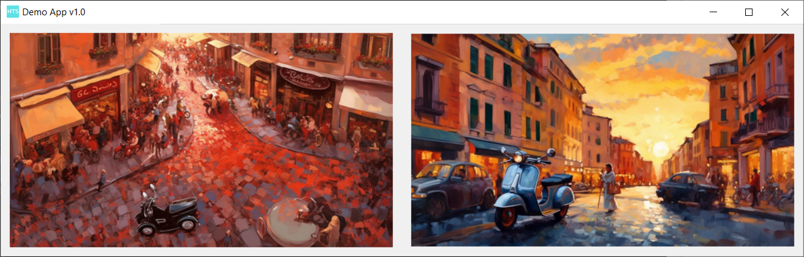

# PyInstaller Build Script

This script uses [PyInstaller](https://pypi.org/project/pyinstaller/) to build your Python project into a .exe app for Windows.

* Builds single file .exe app
* Sets app icon
* Can include image files that might not be found by PyInstaller automatically
* Can include entire Python modules (modules sometime use files that are not automatically found by PyInstaller)
* Includes app version number in app name
* Provides a function to dynamically generate resource paths

When I ran PyInstaller version 5.10.0 from code (```PyInstaller.__main__.run([```) I was unable to get some of 
the more obscure commands (```--collect-all```) to work. I found that those commands worked when PyInstaller was run from
the command line, hence this build script.

### Requirements
* Windows only. This script has not been tested on other OSs
* Python 3. This script was tested with Python 3.10.7
* You need to have the [PyInstaller](https://pypi.org/project/pyinstaller/) module installed.
* This repo contains a ```requirements.txt``` file. Open a Command Prompt, navigate to this code base and run:
```
python -m pip install -r requirements.txt
```
  * The ```requirements.txt``` file refers to a specific version of PyInstaller. You can install PyInstaller independently 
(```python -m pip install PyInstaller```) if you want to use the latest version of PyInstaller.

### Getting Started
Run the following Command Prompt command to build the ```demo_app.py``` Python script provided in this repo into a Windows .exe app.
```
python build_exe.py
```

The built app will be in a newly created ```/executable``` folder. 
When you run the app produced, it should look like this:




### Resource Paths
PyInstaller stores your files (images, icons, etc.) in a temporary folder. When PyInstaller runs your app script, it
refers to this temporary location. Your app script (```demo_app.py``` for example), must use the function shown
in the ```resource.py``` file to dynamically generate the full path to the resource.
* Import ```resource.py``` into your app script:
```python
import resource
```
* Each resource referred to in your app script should get its path using the function provided in ```resource.py```.
For example:
```python
image_2 = tk.PhotoImage(file=resource.get_path("image_2.png"))
```
See ```demo_app.py``` and ```resource.py``` for a working example.

### Custom Icons
You will likely want to use a custom icon for your app.
* You can generate an icon file (```.ico```) from a ```.png``` file by using a [free online converter](https://convertio.co/png-ico/)
* Replace references to ```simple_hts_app_icon.ico``` with the name of your new icon file in ```build_exe.py``` and ```demo_app.py```

### Tailoring the Build Script to Your Needs
* In ```build_exe.py```, adjust the PyInstaller Command Prompt command to meet your needs. Instructions are provided in the code comments.
* The PyInstaller command in ```build_exe.py``` allows you to specify which Python script you want to build into a .exe app. ```demo_app.py``` is just an example.
* To build the app, run the following in your Command Prompt:
```
python build_exe.py
```

### Seeing Errors Produced by Your .exe App
It's possible that your .exe App with throw errors when you first attempt to run it.
* It's likely your script can not find resources it needs (see the Resource Paths section of this README)
* You can see all of the errors produced by your app, by using your Command Prompt to navigate to the ```/executable```
folder where the app is stored. Run the app from the command prompt by using its name as a command.
```
Demo_App_v1_0.exe
```

### Support
Got questions? Feel free to email me at:
* support@hadleytechnicalservices.com

If you need an extra hand with your coding project - I do freelance work.

### Contributing Code Updates To This Repo
Feel free to fork this repo and send me a pull request!
